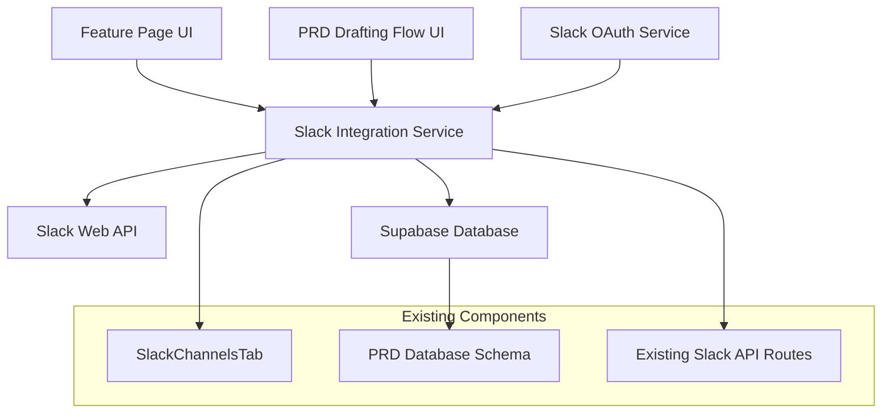

# Design Document

## Overview

The Slack channel integration feature will extend Poppy's existing Slack functionality by adding automated channel creation capabilities. This builds upon the current manual Slack channel linking system to provide seamless channel creation directly from the feature page and PRD drafting flow. The design leverages Slack's Web API for channel creation and maintains consistency with Poppy's existing UI patterns.

## Architecture

### System Components



### Integration Points

1. **Feature Page Integration**: Extends `FeatureDetailView.tsx` component with "Create Slack Channel" button
2. **PRD Flow Integration**: Adds Slack channel creation option to `ChatInterface.tsx` PRD completion flow
3. **API Layer**: Creates new Slack channel creation endpoints that integrate with existing `/api/roadmap/prd/[id]/slack` routes
4. **Database Layer**: Utilizes existing `prd_slack_channels` table schema

## Components and Interfaces

### Frontend Components

#### 1. SlackChannelCreationModal Component
```typescript
interface SlackChannelCreationModalProps {
  isOpen: boolean
  onClose: () => void
  onChannelCreated: (channel: SlackChannel) => void
  featureId: number
  defaultChannelName?: string
  featureSummary?: string
}
```

**Responsibilities:**
- Collect channel configuration (name, description, visibility)
- Handle Slack workspace authentication
- Display creation progress and error states
- Integrate with Slack OAuth flow

#### 2. Enhanced FeatureDetailView Component
**New Features:**
- "Create Slack Channel" button in header actions
- Integration with SlackChannelCreationModal
- Conditional rendering based on existing channels

#### 3. Enhanced ChatInterface Component
**New Features:**
- "Create Slack Channel" button alongside "View PRD" and "Create Design"
- Context-aware channel naming from PRD content
- Integration with feature creation workflow

### Backend Services

#### 1. Slack Channel Creation API
**Endpoint:** `POST /api/slack/channels/create`

```typescript
interface CreateChannelRequest {
  name: string
  description?: string
  is_private: boolean
  feature_id: number
  initial_message?: string
}

interface CreateChannelResponse {
  success: boolean
  channel: {
    id: string
    name: string
    url: string
  }
  error?: string
}
```

#### 2. Slack OAuth Service
**Endpoint:** `GET /api/slack/auth`
- Handles Slack workspace authentication
- Manages OAuth token storage and refresh
- Validates user permissions for channel creation

#### 3. Enhanced Slack Integration Service
```typescript
class SlackIntegrationService {
  async createChannel(params: CreateChannelParams): Promise<SlackChannel>
  async postInitialMessage(channelId: string, message: string): Promise<void>
  async inviteUsers(channelId: string, userIds: string[]): Promise<void>
  async setChannelTopic(channelId: string, topic: string): Promise<void>
}
```

## Data Models

### Slack Authentication Schema
```sql
CREATE TABLE slack_workspace_auth (
  id SERIAL PRIMARY KEY,
  user_email TEXT NOT NULL,
  workspace_id TEXT NOT NULL,
  access_token TEXT NOT NULL,
  bot_token TEXT,
  team_name TEXT,
  created_at TIMESTAMP DEFAULT NOW(),
  updated_at TIMESTAMP DEFAULT NOW(),
  UNIQUE(user_email, workspace_id)
);
```

### Enhanced PRD Slack Channels (Existing Schema)
The existing `prd_slack_channels` table will be enhanced with additional metadata:
```sql
ALTER TABLE prd_slack_channels ADD COLUMN IF NOT EXISTS created_via TEXT DEFAULT 'manual';
ALTER TABLE prd_slack_channels ADD COLUMN IF NOT EXISTS slack_channel_id TEXT;
ALTER TABLE prd_slack_channels ADD COLUMN IF NOT EXISTS workspace_id TEXT;
```

## Error Handling

### Authentication Errors
- **Missing Slack Auth**: Redirect to OAuth flow with return URL
- **Expired Tokens**: Automatic token refresh with fallback to re-auth
- **Insufficient Permissions**: Clear error message with permission requirements

### Channel Creation Errors
- **Name Conflicts**: Suggest alternative names with incremental suffixes
- **Rate Limiting**: Implement exponential backoff with user feedback
- **Network Errors**: Retry mechanism with manual retry option

### User Experience Errors
- **Form Validation**: Real-time validation for channel names and descriptions
- **Loading States**: Progress indicators during channel creation
- **Success Feedback**: Confirmation with direct channel link

## Testing Strategy

### Unit Tests
1. **SlackIntegrationService Tests**
   - Channel creation with various parameters
   - Error handling for API failures
   - Token refresh mechanisms

2. **Component Tests**
   - SlackChannelCreationModal form validation
   - Button state management in FeatureDetailView
   - PRD flow integration in ChatInterface

### Integration Tests
1. **API Endpoint Tests**
   - Full channel creation workflow
   - Authentication flow testing
   - Database integration verification

2. **End-to-End Tests**
   - Feature page to Slack channel creation
   - PRD drafting flow with channel creation
   - Error scenarios and recovery

### Manual Testing Scenarios
1. **Happy Path Testing**
   - Create channel from feature page
   - Create channel during PRD flow
   - Verify channel appears in Slack workspace

2. **Edge Case Testing**
   - Multiple workspace scenarios
   - Permission edge cases
   - Network connectivity issues

## Security Considerations

### Token Management
- Encrypt Slack tokens at rest using Supabase encryption
- Implement token rotation and expiration handling
- Use environment variables for Slack app credentials

### Permission Validation
- Verify user has channel creation permissions before attempting
- Validate workspace membership before token usage
- Implement rate limiting to prevent abuse

### Data Privacy
- Store minimal required Slack workspace data
- Implement data retention policies for auth tokens
- Ensure GDPR compliance for user data handling

## Performance Considerations

### API Rate Limiting
- Implement client-side rate limiting for Slack API calls
- Use exponential backoff for failed requests
- Cache workspace information to reduce API calls

### Database Optimization
- Index frequently queried fields (user_email, workspace_id)
- Implement connection pooling for high-traffic scenarios
- Use database transactions for multi-step operations

### User Experience Optimization
- Implement optimistic UI updates where possible
- Use loading states to manage user expectations
- Provide immediate feedback for user actions